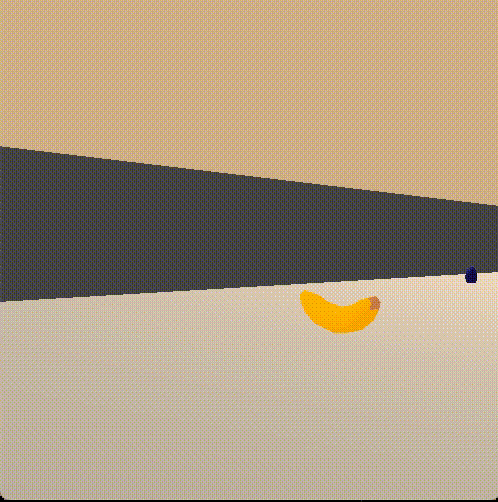

# Navigation with deep reinforcement learning

## about
This repository is an implementation of deep reinforcement learning,
for the first project of [Udacity Nanodegree program "Deep Reinforcement Leraning."](https://www.udacity.com/course/deep-reinforcement-learning-nanodegree--nd893)
The environment is based on "[Unity Banana Collector](https://github.com/ostamand/banana-collector)",
where two types of bananas (yellow ones and blue ones) are randomly placed in a square world,
and an agent is required to collect as many yellow bananas as possible,
while avoiding blue bananas.

## environment
 - states : The state consists of 37 kinds of values,
including the agent's velocity and ray-based perception of objects around it.
 - actions : The agent has 4 possible actions:
move forward or backward and change direction to left or right.
 - rewards : +1 if the agent collects a yellow banana,
 while -1 for a blue banana.
 - This is an episodic-task problem,
 and the agent is required to get an average score better than +13
 over 100 consecutive episodes.

## model
The agent is trained with Deep Q-Network,
where the action-value function is given as deep neural networks.
In addition to using deep neural networks,
several techniques are applied to stabilize learning.
### neural network architecture
The network structure is a fully-connected neural networks
with two hidden layers, where the number of each unit is 64 and 16, respectively.
For simplicity, the agent's state (37 variables) is used
as an input of the neural network.
The outputs are four Q values, corresponding to each of four actions.
The objective function is temporal difference (TD) error,
or mean squred error between an expected Q value and a target Q value.
The expected Q value is an output of the neural network
and the target Q value is obtained as (reward for the state and the action)+gamma*(maximum Q value for the next sate among possible actions),
where gamma is a discount rate and is 0.99 in this repository. 
### epsilon-greedy method
While the agent is being trained,
it select an optimal action, where the largest value is expected,
with probability of 1-epsilon,
while choose an action randomly with epsilon probability.
Large epsilon value, or closer to 1, is used at the beginning,
and it gradually decreased.
Here, epsilon=1 at the beginning
and decreased by a constant rate (0.995) for each episode until it reaches 0.01.
### experience replay
The agent does not learn every time it moves,
but it used past state-action-reward information which is randomly sampled.
For each time step, a tuple of state, action, reward, and next state is stored
in a replay buffer.
It can hold information up to 1e5 steps
and old information is discard to add new information when the buffer is full.
The agent learns, or updates it weight every 4 steps,
where it samples information of 64(=batch size) steps from the replay buffer
and it is used for training.
### fixed target
In calculating the target Q value above, Q values for the next state is taken from a "similar" neural network to one used in calculating the expected Q value.
Here, the "similar" network is 

## installation
[Unity ML-agents](https://github.com/openai/gym) and numpy need to be installed in adavance. 

```
pip install gym
pip install gym[box2d]
```

You also need to download the Unity environment as follows:
 - [for linux](https://s3-us-west-1.amazonaws.com/udacity-drlnd/P1/Banana/Banana_Linux.zip)
 - [for mac](https://s3-us-west-1.amazonaws.com/udacity-drlnd/P1/Banana/Banana.app.zip)
 - [for 64-bit windows](https://s3-us-west-1.amazonaws.com/udacity-drlnd/P1/Banana/Banana_Windows_x86_64.zip)
 - [for 32-bit windows](https://s3-us-west-1.amazonaws.com/udacity-drlnd/P1/Banana/Banana_Windows_x86.zip)
 
Then, after cloning this repository, go to the "deep-reinforcement-leraning" submodule and install necessary libraries as below:

```
cd deep-reinforcement-leraning
pip install .
```

## run training and watch trained agent actions
"my_Navigation.ipynb" is the main file of this repository.
The first part is taken from the sample code provided by Udacity,
and learning part for this is added (from cell #7).

## performance
Here is an example of learning history of the agent.
The training continued until an average score of 100 consecutive episode
reches 16.


The gif file "demo.gif" shows performance of the trained agent.
In this example, the achieved score is 17.



